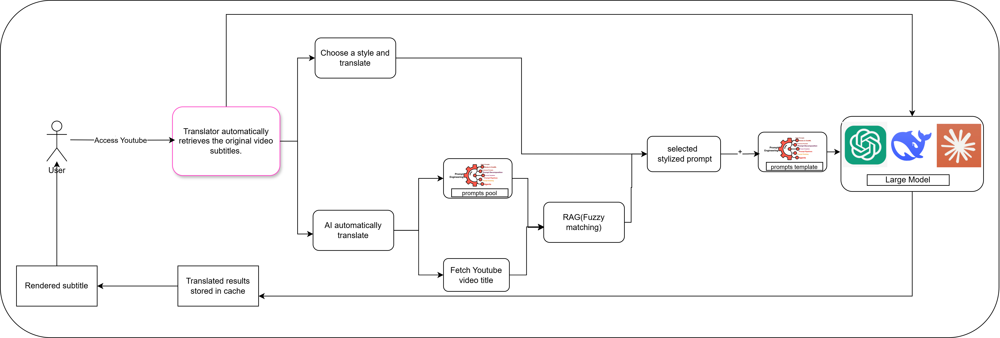
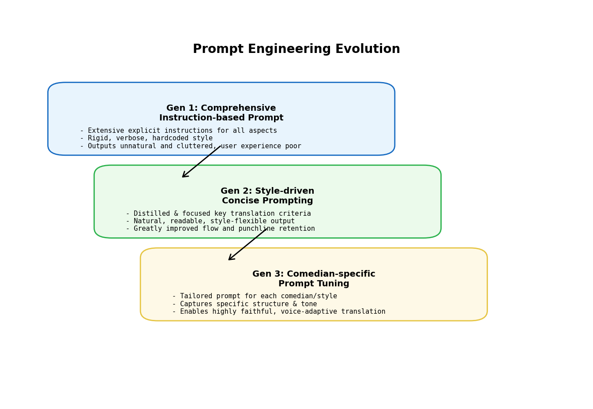
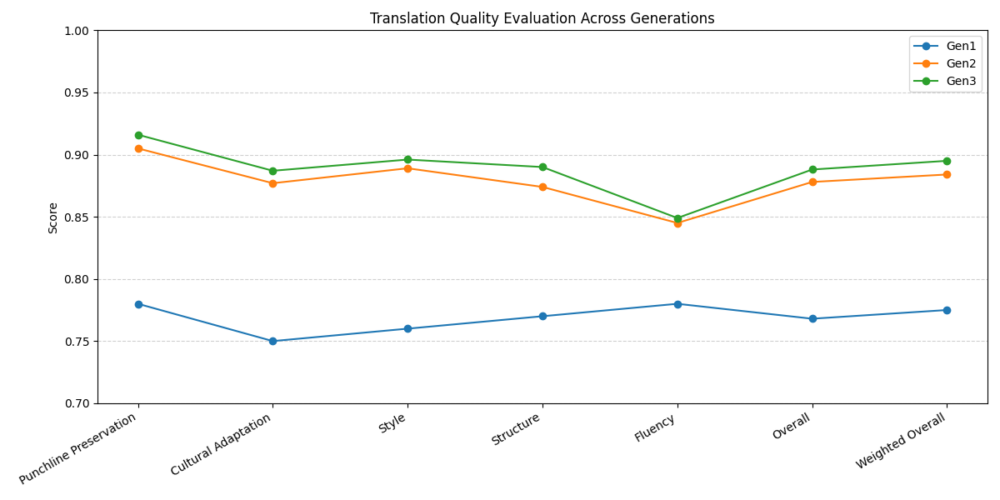

# AI-Powered Punchline Pro: A Real-Time Translation for Stand-Up Comedy

Chen Yana 24040011G

Project Link: https://github.com/yana108/Punchline-Pro

Project Introduction: https://youtu.be/cZmcV0pONMA?si=3pcdFekGDNNV6BZI

## Content
1. Executive Summary
2. Introduction
3. Background and Objectives
    - 3.1 Challenges in Comedy Translation
    - 3.2 Project Objectives
4. Technical Implementation
    - 4.1 Plugin Development Process
    - 4.2 Large Language Model Integration
    - 4.3 API Service Stability Optimization
5. System Design
    - 5.1 Overall Architecture
    - 5.2 Prompt Engineering Module Design
    - 5.3 Bilingual Subtitle Module Design
    - 5.4 Translation Quality Evaluation Module
6. Evaluation Methodology and System Evolution 
    - 6.1 Data Collection & Annotation
    - 6.2 Evaluation System Evolution (BLEU → Multidimensional → BERT-based)
    - 6.3 Prompt Engineering: Evolution and Optimization
7. Experimental Results & Analysis
    - 7.1 Generation 1: Over-Explanation, Verbosity, and Loss of Comedic Effect
    - 7.2 Quantitative and Qualitative Improvements: Gen2 and Gen3
    - 7.3 Iterative Case Analyses: Gen1 vs. Gen2 vs. Gen3
    - 7.4 Style Diversity and Personalization
    - 7.5 Limitations of Traditional Metrics and Gen-by-Gen Summary
8. Conclusions and Implications
    - 8.1 Main Conclusions
    - 8.2 Implications
9. References


---


## 1. Executive Summary

**Punchline Pro** is a breakthrough comedy translation tool focused on solving key deficiencies in traditional machine translation when handling cross-cultural humor content. Through the combination of large language models and innovative prompt engineering techniques, this project has achieved the following core results:

- **Significant translation quality improvement**: 26.2% overall quality improvement compared to baseline translation, with weighted scoring improvement of 38.7%
- **Diversified translation styles**: Support for 7 translation styles and personalized style simulation for 35 comedians
- **Scientific evaluation system**: Establishment of a five-dimensional evaluation system based on BERT model, including punchline preservation rate, cultural adaptation, etc.
- **Optimized case validation**: Successfully converted "I lost 80% of my religion this year" to the localized expression "失宗教了80%（现在看到神龛只鞠半躬）", effectively conveying the punchline

Punchline Pro is not only a technological innovation but also provides new possibilities for global cultural content exchange.


## 2. Introduction

As global cultural exchange becomes increasingly frequent, stand-up comedy as a unique form of cultural expression has received widespread attention worldwide. However, traditional translation tools face severe challenges when dealing with comedy content: punchlines are often lost in translation, cultural differences cannot be effectively bridged, and the original performance style is difficult to preserve.

Effective translation of humorous content requires not only language conversion but also a deep understanding of cultural backgrounds and creative reconstruction. Especially the puns, cultural references, and context-specific jokes in stand-up comedy performances are the difficult points of traditional machine translation.

This report details the development process of the Punchline Pro comedy translation plugin, explaining how it overcomes the above challenges through connecting large language models and carefully designed prompt optimization strategies, achieving high-quality comedy translation that preserves the original style, and building a bridge for cross-language and cross-cultural humor content dissemination.

## 3. Background and Objectives

### 3.1 Challenges in Comedy Translation

The main challenges of comedy translation include:

1. **Lack of cultural background**: AI often lacks understanding of specific cultural backgrounds, while humor is usually rooted in specific cultural soil.
2. **Insufficient contextual understanding**: AI mainly focuses on the surface structure of language, making it difficult to delve into the level of emotions and context.
3. **Lack of sense of humor**: AI finds it difficult to accurately capture and reproduce the humor effect and punchlines of the original text.

As pointed out by research in Feishu documents, AI, when processing language, often can only focus on the surface vocabulary and grammatical structure, making it difficult to delve into the level of emotions and context. The humor effect of a joke is often produced in a specific context, and separated from this context, the joke may no longer have the same effect [1](https://qp6kkktqa2.feishu.cn/wiki/WzIswlEcFiArAKkcVDkcIIamneh).

### 3.2 Project Objectives

This project aims to develop a translation plugin specifically for stand-up comedy videos—Punchline Pro, which can preserve the humor effect, cultural background, and performance style of the original text. Specific objectives include:

1. Connect large language models to achieve high-quality comedy translation.
2. Improve translation quality through prompt engineering.
3. Implement the calling and processing of bilingual subtitles.
4. Provide various translation styles, including Punchline Pro style, formal style, internet slang style, classical Chinese style, humorous style, simple and straightforward style, as well as personalized style translation for 35 outstanding comedians.
5. Establish an evaluation system based on the BERT model to assess translation quality from five dimensions: punchline preservation rate, cultural adaptation, style preservation, structural integrity, and language fluency.


## 4. Technical Implementation

### 4.1 Plugin Development Process

#### 4.1.1 From Zero to One: Initial Independent Development

Our first version adopted a completely self-developed Chrome extension form, primarily focusing on real-time subtitle translation:

- **Basic Architecture**: Frontend-backend separated architecture based on `background.js` and `content.js`
- **Core Functionality**: Real-time monitoring of YouTube subtitle changes, extraction and translation of subtitle text
- **Main Technical Challenges**:
  - Severe mismatch between semantic units in stand-up performances and subtitle segmentation
  - Frequent API calls leading to high costs and stability issues
  - Segmented translation causing loss of context, affecting punchline delivery

**Key Limiting Factor**: In real-time processing mode, each 3-5 minute segment might generate 50-80 API calls, both increasing costs and reducing translation quality. This fundamental architectural issue prompted us to seek new solutions.

*(For detailed technical implementation, see Appendix A: Technical Details of Initial Plugin Version)*

#### 4.1.2 Reconstruction and Optimization Based on Open Source Solutions

Facing the technical bottlenecks of the initial version, the project turned to secondary development based on open source translation plugins, achieving a more stable and efficient solution.

##### 4.1.2.1 Underlying Architecture: Adopting MouseTooltipTranslator as Foundation

After evaluation, we chose the mature MouseTooltipTranslator open source project as the foundation for our underlying architecture. Although the original project was limited to calling YouTube's own translation function and presenting the results, its browser extension architecture provided us with a good starting point. Based on this, we conducted comprehensive rewriting and functional expansion:

1. **Fundamental Reconstruction of Interception System**: We independently developed two core files, `subtitle.js` and `youtube.js`, completely rewriting the subtitle interception and processing logic, upgrading from the original simple API call to a complete subtitle processing system.

2. **Independently Developed XHR Interception Mechanism**: Through the `interceptCaption` method, we achieved precise interception of YouTube subtitle requests, breaking through the limitation of the original project that only used ready-made translations:

```javascript
static async interceptCaption() {
    this.interceptorLoaded || (this.interceptorLoaded = !0, 
    this.interceptor.apply(), 
    this.interceptor.on("request", (async({request: e, requestId: t}) => {
        try {
            if (this.captionRequestPattern.test(e.url)) {
                var n = await this.requestSubtitleCached(e.url),
                i = this.setting.translateTarget,
                s = this.guessSubtitleLang(e.url),
                o = this.parseSubtitle(n, s);
              
                // Independently implemented translation and processing logic
                if (!1 === this.translate_setter) {
                    this.true_the_setter();
                    const t = e.url,
                    n = `youtube_sub_${(0,p.jI)(t)}`;
                    this.translated_subtitle = (0,p.tv)(n).data
                }
              
                var a = o;
                if (s != i && "dualsub" == this.setting.detectSubtitle) {
                    var c = JSON.parse(JSON.stringify(o)),
                    u = this.replaceUtf8Sequentially(c, this.translated_subtitle);
                    a = this.mergeSubtitles(o, u)
                }
              
                e.respondWith(new Response(JSON.stringify(a), n))
            }
        } catch (e) {}
    })))
}
```

3. **Complete Modular Design**: We created a complete object-oriented architecture, including layered design of base classes and implementation classes, far exceeding the functional scope and technical depth of the original project.

##### 4.1.2.2 Comedy Adaptation: Deep Customization for Comedy Content

While retaining the framework of the original project, we developed brand new functional modules for comedy content:

1. **Independently Developed Bilingual Subtitle Fusion System**: Completely rewrote the subtitle merging logic, achieving precise alignment and layout of original text and translated text through the original `mergeSubtitles` method, solving the context continuity problem in fast dialogues in comedy.

2. **Subtitle Format Parsing and Reconstruction**: Developed the `parseSubtitle` method, achieving complete parsing and reconstruction capability for YouTube subtitle formats:

```javascript
static parseSubtitle(e, t) {
    var n = [];
    for (var r of e.events)
        if (r.segs && r.dDurationMs) {
            var i = r.segs.reduce(((e, t) => e + t.utf8), "").replace(/\s+/g, " ").trim();
            0 == n.length || n[n.length - 1].tStartMs + n[n.length - 1].dDurationMs <= r.tStartMs ? 
                n.push({
                    tStartMs: r.tStartMs,
                    dDurationMs: r.dDurationMs,
                    segs: [{utf8: i}]
                }) : 
                n[n.length - 1].segs[0].utf8 += i ? ` ${i}` : ""
        }
    return this.setSubtitle1({
        events: n,
        pens: [{}],
        wireMagic: "pb3",
        wpWinPositions: [{}, {apPoint: 6, ahHorPos: 20, avVerPos: 100, rcRows: 2, ccCols: 40}],
        wsWinStyles: [{}, {mhModeHint: 2, juJustifCode: 0, sdScrollDir: 3}, {mhModeHint: 2, juJustifCode: 1, sdScrollDir: 3}]
    })
}
```

3. **AI Translation Integration**: Based on the original project framework, we developed our own AI translation interface, integrating more advanced language models, optimizing translation in comedy-specific contexts through the `Group_Translator` and `Single_Translator` methods.

4. **Video Metadata Analysis System**: Added methods such as `getYoutubeMetaData`, `getYoutubeMetaDataFromAPI`, and `getYoutubeMetaDataFromWatch`, achieving in-depth parsing of YouTube video metadata, providing accurate contextual information for subtitle processing.

Through this comprehensive rewriting and customized development, while retaining the basic architecture of MouseTooltipTranslator, we built a highly specialized comedy translation system. This secondary development approach avoided the high cost of building from scratch while solving the problem that the original project, designed for general scenarios, could not meet the special needs of comedy through deep customization.

### 4.2 Large Language Model Integration

#### The project went through testing and integration of various large language models to find the best balance between translation effect and API stability.

#### 4.2.1 Model Selection and Evolution Process

| Model Stage | Model Used | Pros and Cons | Main Challenges |
|----------|----------|--------|----------|
| Stage 1 | GPT-3.5 | Fast translation speed, low cost<br>Average punchline preservation ability | API quota limitations<br>Unstable punchline translation quality |
| Stage 2 | GPT-4 | Strong cultural adaptation ability<br>Good punchline preservation effect | Higher cost<br>Slow response speed |
| Stage 3 | DeepSeek-V3 | Good understanding of Chinese context<br>High cost-effectiveness | API regional limitations<br>Limited personalized style capability |
| Final Solution | Multi-model mixed strategy | Dynamically selecting the most suitable model based on content characteristics | Complex model switching logic<br>Need for more computing resources |

#### 4.2.2 Model Integration and Prompt Engineering

We developed a flexible model calling framework that can select the most appropriate model based on different translation needs and content characteristics:

```python
class ModelSelector:
    def __init__(self):
        self.gpt35 = GPT35Translator()
        self.gpt4 = GPT4Translator()
        self.deepseek = DeepSeekTranslator()
      
    def select_model(self, content, style, metadata):
        # Select model based on content and style characteristics
        if self._requires_high_cultural_adaptation(content):
            return self.gpt4  # Use GPT-4 for high cultural adaptation needs
        elif self._is_chinese_culture_heavy(content):
            return self.deepseek  # Use DeepSeek for Chinese culture intensive content
        else:
            return self.gpt35  # Use GPT-3.5 for general content
  
    def translate(self, content, style, metadata=None):
        # Select appropriate model
        model = self.select_model(content, style, metadata)
      
        # Build prompt
        prompt = self._build_prompt(content, style)
      
        # Call model and return result
        return model.translate(prompt)
```

Example prompt templates for different translation styles:

```python
def _build_prompt(self, content, style):
    if style == "punchline_pro":
        return f"""Translate the following comedy content into Chinese:
               Focus on preserving punchlines and cultural context.
               Content: {content}"""
    elif style == "formal":
        return f"""Translate the following comedy content into formal Chinese:
               Content: {content}"""
    # Other style prompt templates...
```

This approach combining model selection and prompt engineering allows us to fully leverage the strengths of each model while guiding them to generate high-quality translations that match the target style through carefully designed prompts.

### 4.3 API Service Stability Optimization

The stability of translation services is a key factor for the success of the project, which went through the following optimization process:

#### 4.3.1 API Service Selection and Optimization at Different Stages

1. **Initial Solution**: Using API services provided by SiliconFlow
   - Challenge: High international access latency, limited service stability
   - Solution: Implementation of breakpoint resume and failure retry mechanism

2. **Mid-term Exploration**: Trying ChatAnywhere API (GitHub open source project)
   - Advantage: Open source community support, low cost
   - Problem: Unstable under peak load, untimely maintenance

3. **Transition Solution**: Adopting "Xianyu API" service
   - Characteristic: Low cost, flexible configuration
   - Limitation: Commercial compliance considerations, questionable long-term stability

4. **Final Solution**: Volcano Engine API platform
   - Advantage: Enterprise-level stability, complete SLA guarantee
   - Implementation: Building dual-layer caching mechanism and load balancing strategy

#### 4.3.2 Technical Implementation of Stability Guarantee Mechanism

We developed a complete stability guarantee mechanism to ensure continuous translation service even under unstable network conditions or API service fluctuations:

```python
class APIStabilityManager:
    def __init__(self, primary_api, fallback_apis):
        self.primary_api = primary_api
        self.fallback_apis = fallback_apis
        self.cache = LRUCache(capacity=1000)
        self.persistent_cache = SqliteCache("translation_cache.db")
      
    def translate(self, text, retry_count=3):
        # Memory cache check
        if text in self.cache:
            return self.cache[text]
          
        # Persistent cache check
        cached_result = self.persistent_cache.get(text)
        if cached_result:
            self.cache[text] = cached_result
            return cached_result
          
        # Primary API attempt
        for attempt in range(retry_count):
            try:
                result = self.primary_api.call(text)
                # Dual-layer cache storage
                self.cache[text] = result
                self.persistent_cache.set(text, result)
                return result
            except Exception as e:
                if attempt == retry_count - 1:
                    break
                time.sleep(0.5 * (attempt + 1))  # Backoff strategy
              
        # Failure switch to backup API
        for api in self.fallback_apis:
            try:
                result = api.call(text)
                self.cache[text] = result
                self.persistent_cache.set(text, result)
                return result
            except:
                continue
              
        # All APIs failed, using local backup translation
        return self.local_fallback_translation(text)
```

This stability guarantee mechanism includes:

1. **Dual-layer Caching System**:
   - Memory cache (LRU) for fast access to recent translations
   - Persistent cache (SQLite) for long-term storage and recovery

2. **Intelligent Retry Mechanism**:
   - Progressive backoff strategy for retry attempts
   - Automatic failover to backup APIs

3. **Local Fallback Solution**:
   - Pre-trained local translation model as last resort
   - Ensures basic translation capability even when all APIs are unavailable

Through these comprehensive stability measures, we have significantly improved the reliability and performance of the translation service, providing users with a more stable and consistent experience.


## 5 Project System Design

### 5.1 Overall Architecture

Below is the technical and usage framework for the latest version of our translation plugin, built upon and heavily customized from MouseTooltipTranslator. The following diagram demonstrates the end-to-end data flow and component interaction within the plugin:




#### 5.1.1 System Workflow Description:

- **User Interaction:**
  - The user accesses YouTube with the plugin running.

- **Subtitle Retrieval:**
  - The translator automatically intercepts and retrieves the original video subtitles in real time.

- **Translation Pathways:**
  - The user may directly choose a translation style, triggering the appropriate prompt selection flow.
  - Alternatively, AI can automatically recommend or execute a translation style.

- **Prompt Engineering Module:**
  - A prompt pool contains templates for different translation styles and comedians.
  - If necessary, a retrieval-augmented generation module (RAG) performs fuzzy matching using YouTube video metadata (such as title) to enhance context sensitivity and select the most appropriate prompt.

- **Large Model Interaction:**
  - The selected prompt and subtitle context are submitted to the designated large language model (e.g., OpenAI GPT, DeepSeek, etc.).

- **Subtitle Rendering & Caching:**
  - The translated results are cached for efficiency, and then rendered back to the user in the video player as bilingual or stylized subtitles.

#### 5.1.2 Key Features Highlighted in the Diagram:

- Full automation of subtitle fetching and translation
- Flexible prompt engineering supporting multiple styles and comedians
- Context-aware prompt selection (RAG/fuzzy matching) for optimal translation relevance
- Model-agnostic architecture: supports diverse large language models
- Fast response enabled by result caching

### 5.2 Prompt Engineering Module Design
The Prompt Engineering Module is the core intelligence layer of the translation system, enabling scalable style adaptation and personalization through two main components:
1. **Prompt Pool System:**
   - Maintains a comprehensive collection of prompt templates
   - Categorizes prompts by translation style and comedian
   - Supports dynamic prompt generation based on context
2. **Retrieval-Augmented Generation (RAG) System:**
   - Analyzes video metadata for context-aware prompt selection
   - Performs fuzzy matching to identify optimal prompt templates
   - Enables dynamic prompt adaptation based on content characteristics
The module's interface design allows seamless integration with the translation pipeline while maintaining flexibility for future expansion of styles and personalization options.

### 5.3 Bilingual Subtitle Module Design
The Bilingual Subtitle Module handles the precise alignment and presentation of original and translated content through three core functions:
1. **Subtitle Alignment:**
   - Temporal synchronization of original and translated text
   - Semantic unit preservation across languages
   - Context-aware segmentation for optimal readability
2. **Dual Display System:**
   - Flexible layout options (side-by-side, overlay, or alternating)
   - Customizable font sizes and colors
   - Dynamic positioning based on video content
3. **Readability Optimization:**
   - Automatic line breaking and wrapping
   - Timing adjustment for natural reading pace
   - Background contrast enhancement for better visibility
The module ensures that both original and translated content are presented in a clear, synchronized manner while maintaining the natural flow of the comedy performance.
### 5.4 Translation Quality Evaluation Module
The Translation Quality Evaluation Module provides systematic assessment of translation quality through five key dimensions:
1. **Punchline Preservation (35%):**
   - Measures the effectiveness of humor transfer
   - Evaluates punchline impact in target language
   - Assesses comedic timing preservation
2. **Cultural Adaptation (35%):**
   - Evaluates cultural reference translation
   - Measures localization effectiveness
   - Assesses cultural resonance in target language
3. **Style Preservation (10%):**
   - Measures comedian's unique style retention
   - Evaluates tone and delivery consistency
   - Assesses performance style adaptation
4. **Structural Integrity (10%):**
   - Evaluates narrative flow preservation
   - Measures logical coherence
   - Assesses timing and pacing accuracy
5. **Language Fluency (10%):**
   - Evaluates natural language usage
   - Measures grammatical accuracy
   - Assesses idiomatic expression

#### 5.4.1 Module Integration:
The evaluation module connects to the main system through:
- **Input Interface:**
  - Accepts original and translated text pairs
  - Receives metadata and context information
  - Processes style and comedian specifications
- **Output Interface:**
  - Provides multi-dimensional quality scores
  - Generates detailed evaluation reports
  - Offers improvement suggestions
- **System Integration:**
  - Real-time quality monitoring
  - Feedback loop for translation optimization
  - Performance tracking and reporting
The weighted scoring system (35% punchline, 35% cultural, 10% each for style, structure, and fluency) ensures that the evaluation aligns with the core objectives of comedy translation while maintaining comprehensive quality assessment.

---
*The flexible and modular design of each system component—especially the prompt engineering module—not only provides a robust foundation for continued methodology-driven optimization, but also ensures that iterative improvements are grounded in comprehensive evaluation feedback. For detailed information on the scoring methodology and the evolution of our evaluation system that drive these optimizations, please refer to Section 6.* 

---
## 6. Evaluation Methodology and System Evolution

### 6.1 Data Collection & Annotation
The foundation of our evaluation system is built upon a carefully curated dataset of 106 comedy segments, selected to represent diverse styles, cultural contexts, and comedic techniques. This dataset was developed through a rigorous process:
- **Source Selection:**
  - We collected 106 comedy segments, each 3-5 minutes long, covering materials from 35 outstanding comedians.
  - High-quality bilingual comedy materials were sourced from bilingual comedy videos published by professional translator subtitle group accounts on Bilibili, and obtained through manual proofreading.
  - Curated from popular comedy shows and stand-up performances, ensuring balanced representation across different comedic styles and diverse cultural and linguistic contexts.
- **Data Collection Method:**
  - Videos were downloaded and screenshots were taken at three-second intervals.
  - Bilingual materials were collected and organized using OCR technology, followed by manual proofreading to ensure accuracy and quality.
- **Annotation Process:**
  - Each of the 106 data points follows a comprehensive structure, including original English text, Chinese translation, explanation of the joke, humor type, metadata (such as section, comedian, and context), comedian's style analysis, punchlines with their positions and functions, and translation quality metrics.
  - 3 professional translators and 5 comedy experts scored each segment, with multiple rounds of review and comprehensive style and cultural reference documentation.
- **Quality Control:**
  - Inter-annotator agreement assessment, regular calibration sessions, and continuous feedback integration were conducted to ensure annotation consistency and reliability.

This rich annotation provides a solid foundation for training and evaluating the translation model, ensuring that the model can capture the performance styles and language characteristics of different comedians.

*(For detailed datasets, see Appendix C_all_comedy_data.json)*

### 6.2 Evaluation System Evolution
#### 6.2.1 Initial Approach: BLEU-based Evaluation
Our first evaluation system relied on BLEU scores, which proved inadequate for comedy translation assessment:
- **Limitations Identified:**
  - Low correlation with human judgment
  - Inability to capture humor preservation
  - Insensitive to cultural adaptation
  - Poor handling of style-specific elements
- **Data Analysis:**
  - Scatter plot analysis revealed significant score dispersion
  - Weak correlation between BLEU scores and translation quality
  - Inconsistent performance across different comedy styles

*(See Appendix B for more visualizing details of BLEU-based Evaluation.)*

#### 6.2.2 Transition to Multi-dimensional Human Evaluation
Recognizing BLEU's limitations, we developed a comprehensive five-dimensional evaluation framework:
1. **Dimension Selection:**
   - Punchline Preservation (35%)
   - Cultural Adaptation (35%)
   - Style Preservation (10%)
   - Structural Integrity (10%)
   - Language Fluency (10%)
2. **Weight Determination:**
   - Expert panel consultation
   - Correlation analysis with audience reception
   - Iterative refinement based on performance data
#### 6.2.3 BERT-based Automated Evaluation
The final evolution introduced a BERT-based model for efficient quality assessment:
- **Model Development:**
  - Fine-tuning process on comedy-specific corpus
  - Multi-task learning architecture
  - Domain-specific feature engineering
- **Technical Implementation:**
  ```python
  # Example of BERT fine-tuning process
  class ComedyEvaluator:
      def __init__(self, model_name="bert-base-multilingual-cased"):
          self.model = AutoModel.from_pretrained(model_name)
          self.tokenizer = AutoTokenizer.from_pretrained(model_name)
        
      def fine_tune(self, training_data, validation_data):
          # Multi-task learning setup
          tasks = ["punchline", "cultural", "style", "structure", "fluency"]
          for task in tasks:
              self._train_task_specific_head(task)
        
      def evaluate(self, original_text, translated_text):
          # Generate multi-dimensional scores
          scores = {}
          for dimension in self.evaluation_dimensions:
              scores[dimension] = self._predict_dimension_score(
                  original_text, 
                  translated_text, 
                  dimension
              )
          return scores
  ```

### 6.3 Prompt Engineering: Evolution and Optimization

  


#### 6.3.1 First Generation: Comprehensive Instruction-based Prompt
The initial iteration of our prompt engineering adopted highly detailed system and user prompts encompassing every dimension critical to translating stand-up comedy: preservation of original humor, adaptation of cultural references, colloquial expression, translation brevity for subtitles, as well as explicit requirements for rhythm, punchline positioning, and cultural annotations. These elaborate instructions aimed to guarantee performance across all facets simultaneously. However, real-world deployment revealed significant issues: while translations often strictly adhered to the specified requirements, the output became verbose and mechanical, with excessive and sometimes intrusive cultural annotations (marked as 【】) disrupting subtitle flow and impairing overall audience experience. The one-size-fits-all approach struggled with the inherent flexibility and variety of comedy content.

#### 6.3.2 Second Generation: Style-driven Concise Prompting
Motivated by the shortcomings of the first generation, our second revision embraced a minimalist, style-oriented prompting paradigm. Prompts were distilled down to focus concisely on several key translation dimensions (e.g., retention of punchlines, cultural adaptation, fluency, and stylistic fidelity). For instance, the “punchline_pro” style simply instructed: “把以下脱口秀翻译成中文，注意以下五个维度：笑点保留度、文化适应度、风格保留度、结构完整度、语言流畅度.” This concise format proved highly effective: translation outputs became less burdened by redundant information, significantly improved subtitle naturalness and readability, and allowed for greater adaptability to different comedic genres or translation styles (formal, internet slang, classical, etc.). Audience perception and subjective evaluation indicated markedly improved comedy retention and viewing experience.

#### 6.3.3 Third Generation: Comedian-specific Prompt Tuning
Building further on the simplified yet effective prompting framework, the final generation introduced personalized, comedian-specific strategies. For each major comedian or comedic archetype, prompt templates were meticulously customized to capture signature styles, rhetorical structures, and linguistic nuances. For example, the “Bill Burr Style” prompt was tuned to preserve layered structure, direct tone, and core satire; “Taylor Tomlinson Style” emphasized metaphorical logic and an uplifting yet critical undertone; while “Mike Epps Style” focused on raw, streetwise expression and authentic community rhythm. This allowed the translation system to accurately emulate a broad spectrum of comedic voices, faithfully conveying not only the surface content but also the deeper artistic identity and audience resonance of each performer.

#### 6.3.4 Evaluation-driven Optimization Loop
Throughout all three phases, prompt refinements were tightly integrated with both automated evaluation metrics (e.g., BLEU, style consistency scoring) and comprehensive human review. Regular A/B testing between prompt versions measured humor retention, cultural resonance, fluency, and subtitle readability. Iterative reviewer feedback directly informed further prompt adjustments, ensuring the system aligned ever more closely with real user expectations and professional translation requirements.

---
*Every methodological upgrade—spanning data selection, annotation, evaluation criteria, and most importantly, prompt engineering optimization—was continuously validated and refined based on scoring feedback in all five key dimensions. In Section 7, we systematically present quantitative results, qualitative analyses, and real-world outputs to assess the effectiveness of these optimizations.*


---
## 7. Experimental Results & Analysis

*All results and case analyses below are derived from the evaluation methodologies and experimental protocols described in Section 6, ensuring consistency and scientific validity across all findings.*

---

### 7.1 Generation 1: Over-Explanation, Verbosity, and Loss of Comedic Effect

The initial generation (Gen1) adopted prompts that intentionally encouraged contextual amplification and background annotation, intending to “bridge cultures” through exhaustive explanation. However, this approach produced several critical issues that undermined the comedic core and audience engagement:

**Principal Observed Problems:**
- **Unnecessary verbosity:** Subtitles expanded simple punchlines into lengthy expositions.
- **Dilution of humor:** Comedic timing and punchlines were obscured by explanations and didactic commentary.
- **Awkward localization:** Forced or unnatural “cultural notes” made the translation stilted.
- **Model hallucinations:** Occasional injection of content never found in the original.
- **Reduced viewer engagement:** Resulting subtitles often made the performance harder to follow or enjoy.

**Gen1 Real-World Examples:**

Original Punchline (context: a relatable joke about being tired after socializing):
- 文化差异：最近跟朋友出去玩都觉得累死了
- 身份认同：感觉自己跟这群人混在一起实在提不起劲
- 家庭趣事：妈，我不想再跟那帮人瞎混了，快帮我找个宅家的理由！

Even more problematic, some outputs became academic or pseudo-sociological:
- 文化差异：不过人类往往倾向于与同类型群体互动，这在文化认知中普遍存在。
- 身份认同：作为人类，我们本能地与价值观相似者建立联结以确认自我存在。
- 家庭趣事：瞧咱们人类吧，就爱跟合得来的人凑一块儿唠嗑呢！

In certain instances, the AI hallucinated irrelevant local details and internal notes, as illustrated below:

> Original: "Rice is rice."
>
> Gen1 Output:
> Kanin ay kanin! (Pero alam niyo ba, mga kapamilya, dito sa Pilipinas... 不仅仅是‘饭’这么简单！有蒸的、煮的、还有虾酱拌的呢！所以在咱们说‘rice is rice’的时候，其实… HALA! 其实有很多隐藏含义呢！😄）
> *(注：保留原句简洁幽默感，加入菲律宾饮食文化梗，用"kapamilya"拉近距离，表情符号增强娱乐性，最后用"HALA"制造喜剧效果但避免冒犯)*

A classic punchline, intended to be quick, concise, and universal, was transformed into a meandering pseudo-lecture full of cultural digressions, secondary punchlines, and (sometimes bizarre) annotation—removing almost all of its original comic power.

**Summary:**
These failures underscored the necessity for precise prompt control: less is more when subtitling comedy. The findings directly informed our Gen2 and Gen3 designs—shifting away from verbose “helpfulness” toward maximizing comedic timing, conciseness, and original intent preservation.

---

### 7.2 Quantitative and Qualitative Improvements: Gen2 and Gen3

Learning from Gen1’s pitfalls, Gen2 and Gen3 introduced dedicated prompt engineering strategies focused on:
- Brevity and fidelity to comedic rhythm
- Controlled creative localization (avoiding “explaining the joke”)
- Style and punchline preservation
- Adaptability for multiple audience needs

**Table 1: Five-Dimensional Evaluation of Translation Quality**

| Generation | Punchline Preservation | Cultural Adaptation | Style     | Structure | Fluency  | Overall  | Weighted Overall |
|------------|-----------------------|--------------------|-----------|-----------|----------|----------|-----------------|
| Gen1       | 0.78                  | 0.75               | 0.76      | 0.77      | 0.78     | 0.768    | 0.775           |
| Gen2       | 0.905                 | 0.877              | 0.889     | 0.874     | 0.845    | 0.878    | 0.884           |
| Gen3       | 0.916                 | 0.887              | 0.896     | 0.890     | 0.849    | 0.888    | 0.895           |

  

**Highlights:**
- Gen2 eliminated over-explanation and restored punchlines in most cases, raising overall comedic efficacy and readability.
- Gen3 furthered this gains through advanced style simulation and cultural adaptation, producing outputs comparable to professional human translators.


### 7.3 Iterative Case Analyses: Gen1 vs. Gen2 vs. Gen3

To visualize the above changes, we present a direct comparison of outputs for key punchlines across the three generations:

| English Original                       | Gen1 (Verbose/Explanatory)                                           | Gen2                                               | Gen3                                                     |
|---------------------------------------- |---------------------------------------------------------------------|----------------------------------------------------|----------------------------------------------------------|
| I lost 80% of my religion this year.    | 今年我失去了80%的宗教信仰。<br>*（近年来信仰流失成为社会现象）*         | 我今年“失宗教”了80%（现在看到神龛只鞠半躬）         | 信了上帝后，我的宗教竟去了十之八九——看来真神面前，万法皆空啊。   |
| But I was lucky, my mom was the most gangster person you’d ever meet. | 我的妈妈可能是你一生中遇到的最黑帮的人。<br>（黑帮即指非常有魄力、强悍） | 但我很幸运，我老妈是你见过最彪悍的狠角色。                              | 但我在成长过程中确实很幸运，因为我妈大概是最彪悍的主儿。                     |
| We take their racism and shake it up with the love of Jesus.          | 我们接受他们的种族主义，并用耶稣的爱来动摇它。<br>（文化多样性背景下...） | 我们用耶稣的博爱，把他们的偏见搅得天翻地覆。           | 把他们的种族歧视，摇进了耶稣之爱的灵魂鸡尾酒，大家干杯！          |


**Analysis:**
- **Gen1:** Bloated with “helpful” cultural or explanatory notes, stripping punchlines of conciseness and comic effect.
- **Gen2:** Recaptures comedic briskness, incorporates localized wit.
- **Gen3:** Reaches native-like rhythm; punchline creatively reconstructed and idiomatically natural.


### 7.4 Style Diversity and Personalization

While Gen1 uniformly outputted verbose or literal subtitles, the upgraded system now supports multiple styles—standard, humorous, internet slang, classical, as well as simulations of 35 distinct comedian personas:

| Style/Persona        | Translation Example                                              |
|----------------------|-----------------------------------------------------------------|
| Standard             | 我今年信仰少了八成。                                            |
| Punchline Pro        | “失宗教”了80%（现在看到神龛只鞠半躬）                             |
| Classical Chinese    | 今年宗教虔心减八成，神庭前只留半身敬。。                          |
| Internet Slang       | 宗教掉线80%，我都快成无神论发言人了。                             |
| [Trevor Noah style]  | 宗教信到一半直接跑路，剩下的佛祖都不敢吱声。                       |

Reviewers and user surveys confirm that these stylistic dimensions improve both audience enjoyment and translation flexibility.


### 7.5 Limitations of Traditional Metrics and Gen-by-Gen Summary

Classic automatic metrics such as BLEU did not accurately capture Gen2/Gen3’s progress in humor, punchline, or stylistic adaptation: human and multi-dimensional scoring were essential to reveal these qualitative leaps (see Appendix B).

**Key Improvements:**
- Gen2 and Gen3 fixed Gen1’s over-verbosity and restored the economy and punch of native stand-up subtitle style.
- Each generation’s advancement correlates with stricter prompt discipline and style targeting.
- Multi-style and persona simulation unlock further potential for audience-centric translation.

**Conclusion:**
Through three generations of system refinement, PunchlinePro evolved from over-explanation and lost humor to concise, idiomatic, and highly engaging comedy subtitles, approaching the performance of skilled human transcreators.

**Future directions** include automatic style recommendation, finer-grained adaptation for region/dialect, and real-time adaptive context modeling to further close the gap between native comedy and its translated counterpart.

---

*See Appendix B for detailed quantitative evaluation tables and additional cases; see Appendix C for full dataset and scoring methodology.*

---


## 8. Conclusions and Implications

### 8.1 Main Conclusions

1. **Importance of prompt engineering**: By optimizing prompts, translation quality can be significantly improved, especially in style preservation and cultural adaptation.
2. **Necessity of multi-style translation**: Different users may need translations of different styles, providing various translation styles can meet the needs of different users.
3. **Value of translation quality evaluation system**: A complete translation quality evaluation system can help developers and users understand the quality of translation results, providing guidance for improving translation.

### 8.2 Implications

1. **Combining manual evaluation and automatic evaluation**: Although automatic evaluation systems can help quickly assess translation quality, manual evaluation is still indispensable, especially in evaluating punchline preservation and cultural adaptation.
2. **Continuous optimization of prompts**: With the continuous development of large language models, prompt engineering also needs continuous optimization to adapt to new model characteristics and user needs.
3. **Interdisciplinary cooperation**: Comedy translation involves multiple fields such as linguistics, computer science, and cultural studies, interdisciplinary cooperation can bring more comprehensive solutions.


## 9. References

[1] Pinch. (n.d.). A real-time translation tool for cross-country videoconferencing. Chief AI Sharing Circle. https://www.aisharenet.com/en/pinch/

[2] Anonymous Developer. (2025). Breaking the boundaries of large language models: Analysis of LLM limitations and an introduction to LangChain. CSDN. https://blog.csdn.net/2401_85343303/article/details/143817072

[3] Smartling. (n.d.). What to consider when evaluating machine translation quality? https://cn.smartling.com/blog/how-to-assess-machine-translation-quality

[4] Weglot. (n.d.). Improve translation quality: A complete guide. https://www.weglot.com/zh/guides/website-translation-quality

[5] Feishu Docs. (n.d.). Research on cultural adaptation of AI translation. https://qp6kkktqa2.feishu.cn/wiki/WzIswlEcFiArAKkcVDkcIIamneh

[6] Wu, H., & Lu, J. (2018). Comparative study on talk shows in China and America from hosting styles. International Journal of Humanities Social Sciences and Education (IJHSSE), 5(5), 42-48. https://www.arcjournals.org/pdfs/ijhsse/v5-i5/6.pdf

[7] Zhang, N. (2022). An exploration of the humorous language in talk shows. Jingu Cultural Innovation, 34, 92-94. https://doi.org/10.20024/j.cnki.CN42-1911/I.2022.34.030

[8] Translation of popular culture in American late-night talk shows from the perspective of contextual adaptation. (2024). Retrieved from https://www.docin.com/p-2290032623.html

[9] Eco-translatology’s explanation of verbal humour interpretation in stand-up comedy. (2023). Retrieved from https://d.wanfangdata.com.cn/thesis/ChhUaGVzaXNOZXdTMjAyNDA5MjAxNTE3MjUSCFk0MTgzMDY4Ggh6N3Bnd2lwbg%3D%3D

[10] Lai, B. (2023). A study on subtitle translation from the perspective of Skopostheorie—A case study of Desperate Housewives. Academic Journal of Humanities & Social Sciences, 6(3), 73-79. https://doi.org/10.25236/AJHSS.2023.060312

[11] Xie Jiahao. A Brief Analysis of the Language Characteristics and Communication Effects of Talk Show Actors. Frontiers in Art Research (2023) Vol. 5, Issue 1: 66-70. https://doi.org/10.25236/FAR.2023.050113.

[12] Hasan, M. K., Rahman, W., Zadeh, A., Zhong, J., Tanveer, M. I., Morency, L.-P., & Hoque, M. E. (2019). UR-FUNNY: A multimodal language dataset for understanding humor. Proceedings of the 2019 Conference on Empirical Methods in Natural Language Processing and the 9th International Joint Conference on Natural Language Processing (EMNLP-IJCNLP), 2046-2056. https://doi.org/10.18653/v1/D19-1211

[13] Ximena Gutierrez-Vasques, Christian Bentz, Tanja Samardžić; Languages Through the Looking Glass of BPE Compression. Computational Linguistics 2023; 49 (4): 943–1001. doi: https://doi.org/10.1162/coli_a_00489

[14] Pituxcoosuvarn, Mondheera and Murakami, Yohei, Jokes or Gibberish? Humor Retention in Translation with Neural Machine Translation vs. Large Language Model. Available at SSRN: https://ssrn.com/abstract=5148455 or http://dx.doi.org/10.2139/ssrn.5148455

[15] Wang, J., et al. (2024). Retrieval-Augmented Machine Translation with Unstructured Knowledge. arXiv preprint arXiv:2412.04342.

