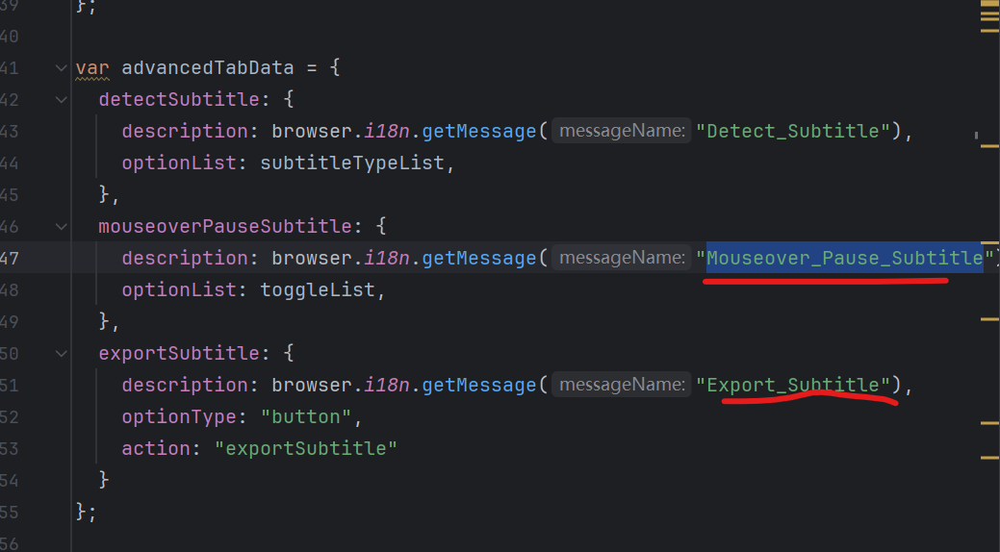
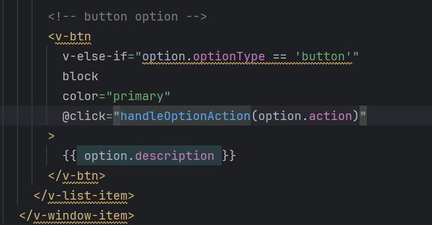
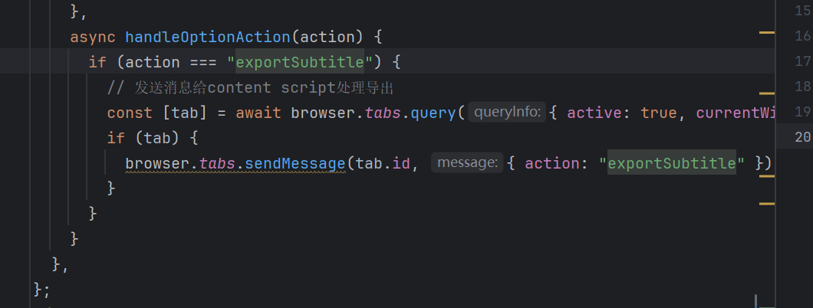

<!-- 如果 option.optionType 等于 'button'，则渲染这个按钮 -->
<v-btn
v-else-if="option.optionType == 'button'"  <!-- 条件渲染指令，当前面的条件不满足且这个条件满足时显示 -->
block                                      <!-- Vuetify 属性，使按钮宽度充满父容器 -->
color="primary"                           <!-- 设置按钮颜色为主题主色 -->
@click="handleOptionAction(option.action)" <!-- 点击事件绑定，点击时调用 handleOptionAction 方法并传入 option.action 参数 -->
>
{{ option.description }}                  <!-- 显示按钮文字内容，来自 option.description -->
</v-btn>

数据来源 (option 对象)

国际化位置

上面advance就是按钮的配置

E:\chrome_plugin\lab2\MouseTooltipTranslator\public\_locales\zh_CN\messages.json
修改description在国际化里添加

action就是

